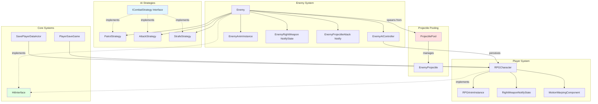

# 3D Third-Person Combat System

A strategic melee combat system with AI-driven enemies featuring dynamic behavior states and optimized projectile pooling.

**Tech Stack:** Unreal Engine 5.6 | C++17 | AI Perception | Strategy Pattern | Enhanced Input | Motion Warping

---

## Development Approach

I built this combat framework to practice AI programming patterns and runtime optimization. The Strategy pattern keeps enemy behaviors modular - each AI state (Patrol, Attack, Strafe) is its own class implementing `ICombatStrategy`. This made adding new behaviors straightforward without bloating the Enemy class.

The player has four attack types with socket-based collision detection using `AnimNotifyState` windows. For blocking, I implemented directional validation with dot product checks - you can only block attacks you're facing. The Motion Warping system dynamically adjusts the jump attack mid-animation to track moving enemies, which solved the problem of attacks missing their targets.

---

## AI Strategy Pattern

Enemy behavior switches between three strategies based on game state. Each strategy handles its own movement logic:

**PatrolStrategy:** Uses NavigationSystem to get random reachable points within 800 units. Moves to point, waits 1-5 seconds, picks new destination.

**AttackStrategy:** Calculates distance to player. Moves within acceptance range, triggers attack montages. After each attack, randomly switches to Strafe (30% chance by default).

**StrafeStrategy:** Calculates point 180° from current facing direction, moves there to create circling behavior around player.

The state machine runs in `Enemy::Tick()` with timing delays to prevent spam. I used `bIsWaiting` flags with timers to control when the next strategy execution happens. This approach gave me more direct control than Behavior Trees for this specific use case.

---

## Projectile Object Pooling

Initially every enemy spawned/destroyed projectile actors per attack. With multiple enemies this caused noticeable frame hitches. I implemented a static object pool shared across all enemy instances:

- Pre-allocates 20 projectiles at startup
- Hides/disables collision instead of destroying
- Expands dynamically if pool exhausted (logs warning for tuning)
- Each projectile knows its owner pool via `SetOwnerPool()`

The pool setup was tricky - since it's static, I had to initialize it when the first enemy spawns with a valid `ProjectileBP` reference. This eliminated the spawning hitches completely.

---

## Motion Warping for Jump Attack

The jump attack performs a line trace forward using `ECC_Pawn` channel. If it hits an enemy within range, I set a warp target at their location using `AddOrUpdateWarpTargetFromLocation()`. The animation asset has a motion warping window that blends the root motion trajectory to land at that point.

I added validation checks because initial implementation would sometimes warp to dead enemies or empty space. Now it verifies the hit actor is actually an Enemy class before setting the warp target. A timer clears warp targets after the attack completes to prevent stale data affecting subsequent attacks.

---

## AI Perception System

Enemy AI uses UE5's AI Perception Component configured with sight sense:

- 1500 unit detection radius, 120° peripheral vision
- 5 second memory duration for last known location
- `OnTargetPerceptionUpdated` delegate triggers `EnterCombat`/`ExitCombat`

When stimulus becomes active (player enters sight), the enemy transitions to Attack state and sets focus on the player. When stimulus is lost, it clears focus and returns to idle behavior. The perception component handles line-of-sight checks and occlusion automatically.

---

## Architecture

---

## Technical Challenges

### Enemy Death Animation Loop

After playing the death montage, enemies would snap back to idle pose. The animation state machine kept running - when the montage finished, it returned control to the state machine which auto-blended to idle.

Fixed with a three-step sequence: unpossess AI controller immediately at death, disable character movement to prevent velocity changes, destroy actor 0.5 seconds before montage ends. Tuning that 0.5 second timing was critical - too early and enemies disappear mid-fall, too late and the idle blend starts showing.

### Directional Blocking

Initial blocking just checked animation state, so you could block attacks from behind. Added dot product validation between player's forward vector and direction to damage source. Block succeeds only if dot product > 0 (facing the attacker). Also added different impact sounds - metallic clang for successful blocks versus flesh impact when hit from behind. This forces players to manage positioning against multiple enemies.

### Projectile Direction Issue

The imported arrow mesh had its forward axis pointing sideways relative to the skeletal mesh socket. Projectiles flew at 90° angles instead of toward the player. Considered reimporting with corrected rotation but that would break existing animations. Instead added an offset transform to the spawn socket that rotates the mesh to face forward, then calculate direction vector to player's chest height (location + 80 units Z) for the projectile movement component. Socket handles mesh orientation, code handles trajectory.

### Stale Strategy References

Used `TObjectPtr` initially for strategy objects but they were getting garbage collected unpredictably. Switched to `TWeakObjectPtr` which allows `IsValid()` checks before executing strategies. Weak pointers prevent dangling references while allowing proper cleanup.

---

## What I Learned

The Strategy pattern made AI behavior more modular than cramming everything into Enemy class. Object pooling had bigger performance impact than expected - frame time difference was noticeable with just 3-4 enemies. Understanding AI Perception saved me from writing custom sight detection. Motion Warping needs careful validation - the system will warp to invalid targets without checks. Mixing C++ for core systems with Blueprint for timing values gave both performance and iteration speed.
