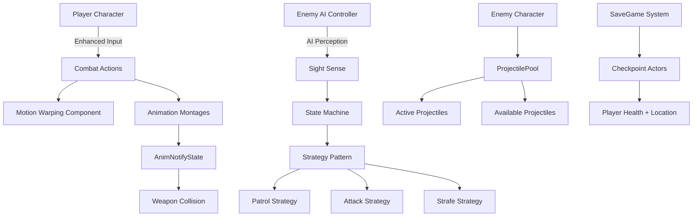
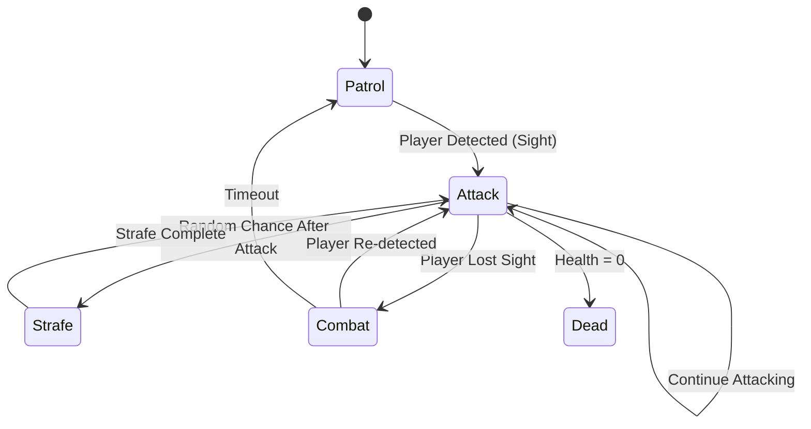

# UE5 RPG Combat System

A third-person melee combat system built for Unreal Engine 5 with AI-driven enemies, strategic combat behaviors, and object pooling optimization.


## What This Is

This is a combat framework I developed for an action RPG game. I implemented a system where players fight against AI enemies that patrol areas, pursue targets, strafe around the player, and launch both melee and ranged attacks. The player has access to multiple attack types including combo chains, heavy strikes, and a motion-warped jump attack that dynamically targets enemies.

I designed the AI to switch between different behavioral states - patrolling when idle, attacking when they detect the player, and strafing to create more dynamic combat encounters. I also implemented a blocking system that uses directional checks, so you can only block attacks you're actually facing.


## Core Systems I Built

### Player Combat System

- I implemented four distinct attack types: basic combo, heavy attack, spin attack, and a motion-warped jump strike that closes distance to enemies
- I built a directional blocking mechanic that uses dot product calculations to verify the player is facing the attacker
- I added three-directional dodge rolls with invincibility frames during the roll animation
- I created weapon collision boxes that activate through AnimNotifyState windows for precise hit detection

### Enemy AI

- I designed a state machine handling Patrol, Attack, Combat, Strafe, and Dead states
- I implemented the Strategy pattern for clean behavior switching between different AI modes
- I integrated UE5's AI Perception system using sight sense for player detection
- I added dynamic attack range adjustment and acceptance radius for engagement control
- I included randomized strafe chance after attacks (configurable between 0-1) to make combat less predictable


### Projectile Pooling System

- I created an object pool shared across all enemy instances to eliminate runtime spawning hitches
- I pre-allocated 20 projectiles with dynamic expansion when the pool runs out
- I implemented a return-to-pool mechanism instead of destroying projectiles
- I added tracking for active/available projectiles to help with debugging and optimization


## Architecture

Here's how I structured the main systems:



## How I Implemented Combat

I built the damage system using collision boxes attached to weapon sockets. When the player attacks, an AnimNotifyState I created activates the collision box for that specific frame window. The box checks for overlaps with the Pawn collision channel and applies damage through Unreal's damage system.

For the blocking mechanic, I calculate whether the player is facing the damage source using this approach:

```cpp
FVector PlayerDirection = GetActorForwardVector();
FVector ActorDirection = (FacingActor->GetActorLocation() - GetActorLocation()).GetSafeNormal();
float DotProduct = FVector::DotProduct(PlayerDirection, ActorDirection);
```

If the dot product is positive, the player is facing the attacker and I allow the block to succeed. Otherwise, damage goes through. I also implemented different sound cues for successful blocks versus body hits to give better feedback.

I added motion warping for the jump attack by tracing forward to find enemies within range, then setting a warp target at their location. This makes the attack feel connected even when enemies are moving, which was important for making combat feel responsive.


## Enemy AI Implementation

I structured the AI controller to use three strategy objects that all implement a common interface. Here's how the state transitions work:



**PatrolStrategy**: I used Unreal's Navigation System to get random reachable points within a radius around the enemy. The AI moves to that point, waits between 1-5 seconds, then picks a new destination.

**AttackStrategy**: I implemented this to move the enemy toward the player until they're within the acceptance range, then trigger attack montages. After each attack completes, I added a random chance to switch to strafing behavior.

**StrafeStrategy**: I calculate a point 180° from the enemy's current facing direction and move them there. This creates the circling behavior you see during combat, making enemies feel more tactical.

## Problems I Solved

### Enemy Death Animation Loop

I ran into an issue where after playing the death montage, enemies would pop back up to their idle pose. This happened because the animation state machine was still running - the montage would finish, return control to the state machine, and it would automatically blend back to idle since that was the default state.

I solved this by implementing a three-step death sequence: I immediately unpossess the AI controller when health hits zero, disable the character movement component to prevent any velocity changes, and destroy the actor 0.5 seconds before the montage finishes. This prevents any state machine transitions from happening and removes the corpse while it's still in a believable death pose. I had to tune that 0.5 second timing carefully - too early and enemies disappear mid-fall, too late and you see the idle blend.

### Projectile Spawning and Direction

I imported an arrow mesh for enemy projectiles, but the mesh had its forward axis pointing sideways relative to how I'd set up the skeletal mesh socket. When I spawned projectiles, they'd fly off at 90° angles instead of toward the player.

I considered reimporting the mesh with corrected rotation, but that would've broken all the existing animations. Instead, I added an offset transform directly to the spawn socket that rotates the mesh to face forward correctly. Then I calculate the direction vector to the player's chest height (their location plus 80 units on the Z axis) and pass that to the projectile movement component. This way the socket handles the mesh orientation issue, and my code just deals with the trajectory math. I also added the InitializeProjectile function to properly reset velocity and rotation when reusing pooled projectiles.

### Blocking From Behind

My initial blocking implementation just checked if the player was in the blocking animation state. This meant you could stand with your back to an enemy and still block their attacks, which felt completely wrong.

I fixed this by adding a dot product check between the player's forward vector and the direction to the damage causer. Now blocking only succeeds when the player is actually facing the threat (dot product > 0). This forces players to manage their positioning and facing when fighting multiple enemies, which made the combat way more engaging. I also added different impact sounds - a metallic clang for successful shield blocks versus a flesh impact sound when attacks hit from behind.

### Runtime Spawning Hitches

Every enemy was spawning and destroying projectile actors each time they attacked. With multiple enemies on screen, this caused noticeable frame hitches during combat, especially on the first few attacks when actors were being initialized.

I implemented a static object pool that all enemy instances share. The pool pre-allocates 20 projectiles at startup and cycles through them. When a projectile hits something or times out, instead of destroying it, I return it to the pool by hiding it, disabling collision, and resetting its state. I made the pool expand dynamically if we run out of projectiles (with a warning log so I can tune the initial size), but in practice 20 has been enough for most combat scenarios. This completely eliminated the spawning hitches and actually made the combat feel snappier overall.

### Motion Warping Target Validation

When I first implemented the jump attack with motion warping, I was setting warp targets without checking if the enemy was still valid or in range. This caused issues where the player would sometimes lunge at empty space or warp to an enemy that had just died.

I added proper validation by doing a line trace from the player forward by the attack distance, checking if we hit something on the Pawn channel, then validating it's actually an Enemy class before setting the warp target. If the trace fails or hits something else, the attack just plays without warping. I also added a timer to clear warp targets after the attack completes, preventing stale targets from affecting subsequent attacks.


## Project Structure

```
Source/UE5_RPG_Combat/
├── Character/
│   ├── RPGCharacter          # Player with combat state machine
│   ├── RPGAnimInstance       # Handles movement blendspaces
│   └── RightWeaponNotifyState # Collision activation window
├── Enemy/
│   ├── Enemy                 # Base enemy with state machine
│   ├── EnemyAIController     # Perception and targeting
│   ├── EnemyAnimInstance     # Enemy movement blending
│   ├── EnemyProjectile       # Pooled projectile actor
│   ├── ProjectilePool        # Shared pool manager
│   └── AIBehavior/
│       ├── ICombatStrategy   # Strategy interface
│       ├── PatrolStrategy    # Wandering behavior
│       ├── AttackStrategy    # Chase and attack
│       └── StrafeStrategy    # Circling movement
├── Core/
│   ├── SavePlayerDataActor   # Checkpoint trigger volumes
│   └── PlayerSaveGame        # Serialized player data
└── Interfaces/
    └── HitInterface          # Hit reaction interface
```

## Technical Implementation Details

I implemented the save system using Unreal's SaveGame class to serialize player health and checkpoint locations. I created checkpoint actors with sphere collision components that call SavePlayerData when the player overlaps them. On level load, I check for existing save data in BeginPlay and teleport the player to their last checkpoint if one exists.

For enemy melee attacks, I used the same AnimNotifyState pattern I developed for the player. The notify activates a box component attached to the weapon socket during specific animation frames for precise hit timing.

I configured the AI sight perception with a 1500 unit detection radius, 120° peripheral vision angle, and 5 second memory duration. When a stimulus becomes active (player enters sight), I call EnterCombat which transitions to the Attack state. When the stimulus is lost, ExitCombat clears the AI's focus target and returns to idle behavior.

The motion warping system I set up performs a line trace using the ECC_Pawn collision channel to find enemies ahead of the player. If I find a valid enemy within the attack's range, I add a warp target at their current location using the attack's motion warp name. The animation asset has a motion warping window configured that blends the root motion trajectory to land the attack at that target position.

I used Enhanced Input for all player controls, mapping combat actions to different input triggers. Block is bound to Started/Completed events for hold-to-block functionality, while attacks use Completed events to prevent input buffering issues during animation playback.

## Dependencies

- Unreal Engine 5.6
- Enhanced Input System
- AI Module (Perception, Navigation)
- Motion Warping Plugin
- Niagara VFX System

## License

[Add your license here]

## Contact

[Add your contact information here]
